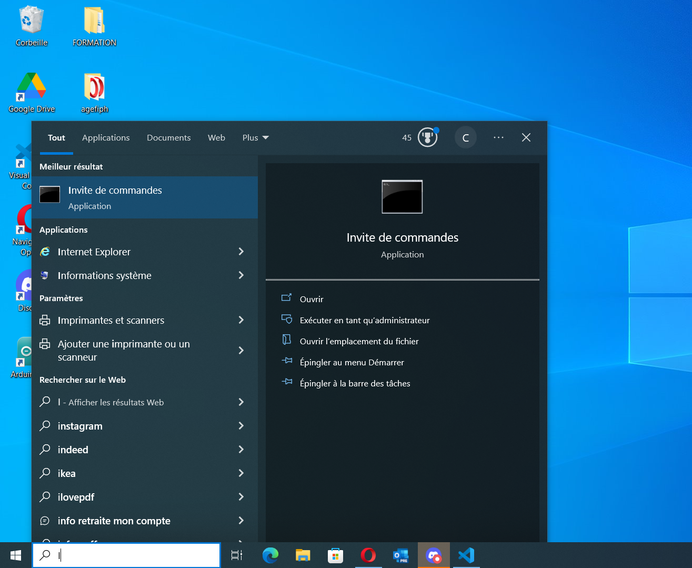
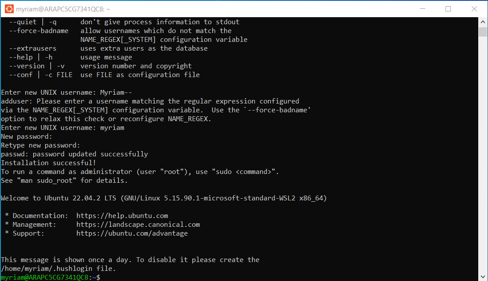
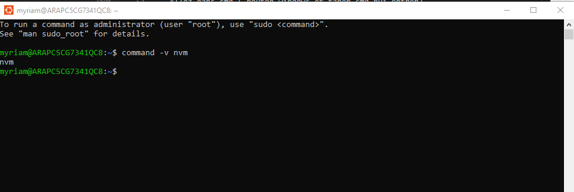
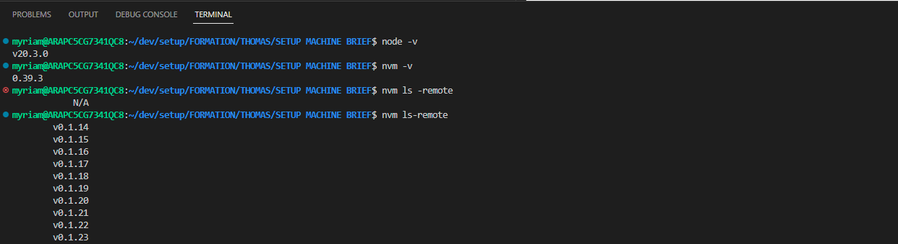

# INSTALLER SON SETUP MACHINE

## ETAPE 1 : INSTALLER WSL
    - Ouvrir l'inviter de commande en mode administrateur (cliquez droit)
    - Entrée la commande : wsl --install

    - Redémarrer son pc
    - Cliquez sur une touche : espace ou entrée ...
    - Vérifier si le wsl est bien intaller sur le menu WINDOWS
    - Installer le terminal WINDOWS (sur le windows store)
    - L'ouvrir et saisir (ubuntu) ensuite probablement un message d'erreur s'affichera dans ce cas ALLEZ DANS LE BIOS --> ADVANCED --> CPU OPTION --> VIRTUALIZATION TECHNOLOGY

    - Sauvegarder et exit
    - Puis tester UBUNTU
    - Entrée nouveau nom UNIX
    - Entrée le password ATTENTION ON NE VOIT PAS LE MOT DE PASSE
    - GIT message d'erreur

    https://learn.microsoft.com/fr-fr/windows/wsl/install

## ETAPE 2 : PARAMETRER GIT SSH
    - Sur UBUNTU, SAISIR ssh-keygen
    - Appuyer sur entrée jusqu'a avoir l'image de la clé
    - Allez dans les fichiers 
    --> LINUX --> UBUNTU --> HOME--> EX: MYRIAM --> DOSSIER.SSH --> id_rsa.pub --> COPIER LES ELEMENTS DU FICHIER --> OUVRIR GITHUB --> PARAMETRES --> SETTINGS --> SSH AND GPG KEYS --> NEW SSH KEY --> SAISIR LE TITRE ET COLLER LA CLE --> ADD SSH KEY --> SAISIR VOTRE MOT DE PASSE GITHUB

    - Vérifier github sur ubuntu saisir (gitclone) espace lien ssh du reposit
    - Taper yes pour confirmer

## ETAPE 3 : WSL AVEC WS CODE

    - Allez dans extension
    - Tapper wsl dans la barre de recherche
    - Sélectionner REMODE Development et installer

## ETAPE 4 : Lié wsl avec github

- Aller sur github.com
- Creer un compte ou connectez vous a votre compte
- Créer un nouveau projet privé ( cliquer sur New )
- Dans le projet , aller dans settings
- Allez dans cmd ( bouton windows et taper cmd pui entrer)
- Dans l'invité de commande de votre machine virtuelle ubuntu , placez   vous (a l aide de la commande cd) dans le dossier ou vous voulez creer la clé ssh
- Dans la console , tapez ssh-keygen puis entrer
- On vous demander de choisir un chemin ou exporter les clés publiques et pivées , puis appuyez sur entrer
- Choisir un mot de passe et le rentrer deux fois ( mot de passe invisible lors del a saisie , c'est normal)
- Ouvrez la  cle publique et copier son contenu
- Le coller sur le site de github dans la section settings > deploy keys > add deploy key et validez en cliquant sur le bouton add.
  
  https://docs.github.com/en/authentication/connecting-to-github-with-ssh

  https://education.github.com/git-cheat-sheet-education.pdf

- après installer node.js
saisir : 
nvm install node
récupréer ladernière version 

